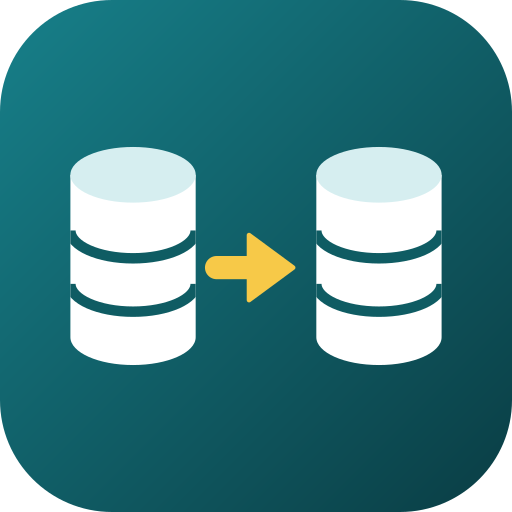
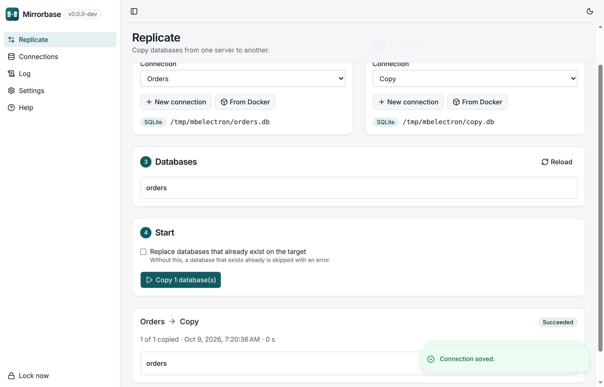
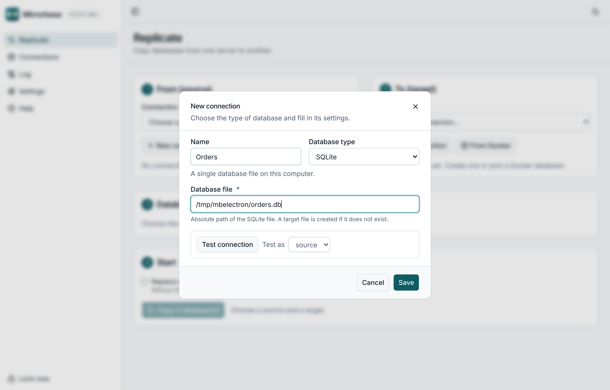
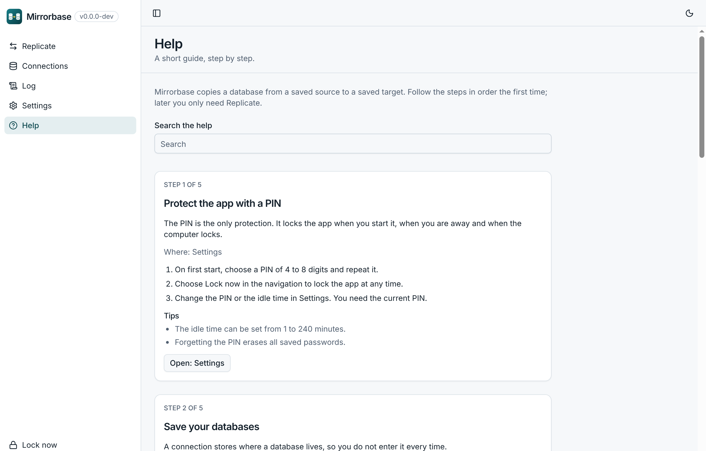

<p align="center">
  
</p>

<h1 align="center">Mirrorbase</h1>

<p align="center">
  Copy a database from one place to another. Pick a saved source and a saved target, press start.
</p>

<p align="center">
  <a href="https://github.com/oldjazjef/mirrorbase/releases/latest"></a>
  <a href="https://github.com/oldjazjef/mirrorbase/actions/workflows/ci.yml"></a>
  <a href="LICENSE"></a>
  
  
</p>

<p align="center">
  <a href="https://buymeacoffee.com/hello.eme">☕ Buy me a coffee</a>
</p>

<p align="center">
  
</p>

---

## What it is

**Mirrorbase** is a small desktop app that copies databases. It grew out of a PowerShell script that
copied a remote PostgreSQL database into a local Docker container, and it keeps that use case at
its heart: bring a server's database to your machine, or move one between two machines, without
retyping connection details or pasting passwords into a terminal.

- **Saved connections.** Enter a database once, pick it from a list afterwards.
- **Passwords kept safe.** Sealed with AES-256-GCM, the key lives in your system keychain. Passwords
  never appear on a command line or in the log.
- **Running Docker databases.** The app lists the database containers running on your computer, so you can pick one instead of typing its port.
- **A log of every run.** Each step and each error, with progress and cancel.
- **Locked by a PIN.** 4 to 8 digits, a growing wait after wrong attempts, locks when you leave
  your computer. There is no account and no other sign-in.
- **Help built in.** A step-by-step guide with search, in English and German.

<p align="center">
  
  &nbsp;
  
</p>

## Databases

Every database type is a **plugin**. The first two ship with the app:

| Type           | How it works                                                                                                                       |
| -------------- | ---------------------------------------------------------------------------------------------------------------------------------- |
| **PostgreSQL** | `pg_dump` and `psql`, run on your machine or in a `postgres:<version>` Docker image if the tools are not installed                 |
| **SQLite**     | SQLite's backup API, written next to the target and renamed over it, with an integrity check, so a target is never half a database |

Source and target must be the same type for now. Copying between different types is planned: the
plugin contract already carries the neutral types for it.

## Download

Grab the installer for your system from the [latest release](https://github.com/oldjazjef/mirrorbase/releases/latest):

| System                | File                             |
| --------------------- | -------------------------------- |
| Windows               | `Mirrorbase-Setup-<version>.exe` |
| macOS (Apple silicon) | `Mirrorbase-<version>-arm64.dmg` |
| macOS (Intel)         | `Mirrorbase-<version>-x64.dmg`   |
| Linux                 | `Mirrorbase-<version>.AppImage`  |

The app is **not signed** yet, so your system warns on the first start. Windows: _More info_ →
_Run anyway_. macOS: right-click the app → _Open_. Linux: `chmod +x` the file. The release notes
have the details.

PostgreSQL copies need `psql` and `pg_dump` on your computer, or Docker.

## Releases

| Version                                                                   | Date       | What                                                                                                           |
| ------------------------------------------------------------------------- | ---------- | -------------------------------------------------------------------------------------------------------------- |
| [**v1.0.0**](https://github.com/oldjazjef/mirrorbase/releases/tag/v1.0.0) | 2026-10-09 | First desktop release: PostgreSQL and SQLite plugins, saved connections, PIN lock, log, Docker discovery, help |
| [1.0.0](https://github.com/oldjazjef/mirrorbase/releases/tag/1.0.0)       | 2026-02-10 | The original PowerShell script, kept in [`legacy/`](legacy/)                                                   |

All releases, with their installers: [github.com/oldjazjef/mirrorbase/releases](https://github.com/oldjazjef/mirrorbase/releases).

## Security

- Passwords are sealed with AES-256-GCM; the key is protected by the OS keychain.
- Passwords reach `psql` and `pg_dump` through the environment, never as arguments, and everything
  written to the log is scrubbed of secrets and connection strings.
- The app talks to its own local API over a loopback-only connection with a per-launch token.
- Forgetting the PIN erases every saved password. That is the price of a lock without an account.

## Build it yourself

```bash
pnpm install
pnpm start:desktop      # builds web + API, stages, starts Electron
pnpm build:desktop      # installer for this OS into dist/desktop
pnpm check              # lint + budget + format + test + build + typecheck
```

Electron, Angular, NestJS and Prisma with SQLite, as an Nx monorepo. Developer notes, layout and
rules: [CLAUDE.md](CLAUDE.md). Releases are made with the _Release_ workflow in the Actions tab.

## Support

Mirrorbase is free. If it saves you time, you can buy me a coffee.

<p align="center">
  <a href="https://buymeacoffee.com/hello.eme" target="_blank"></a>
</p>
